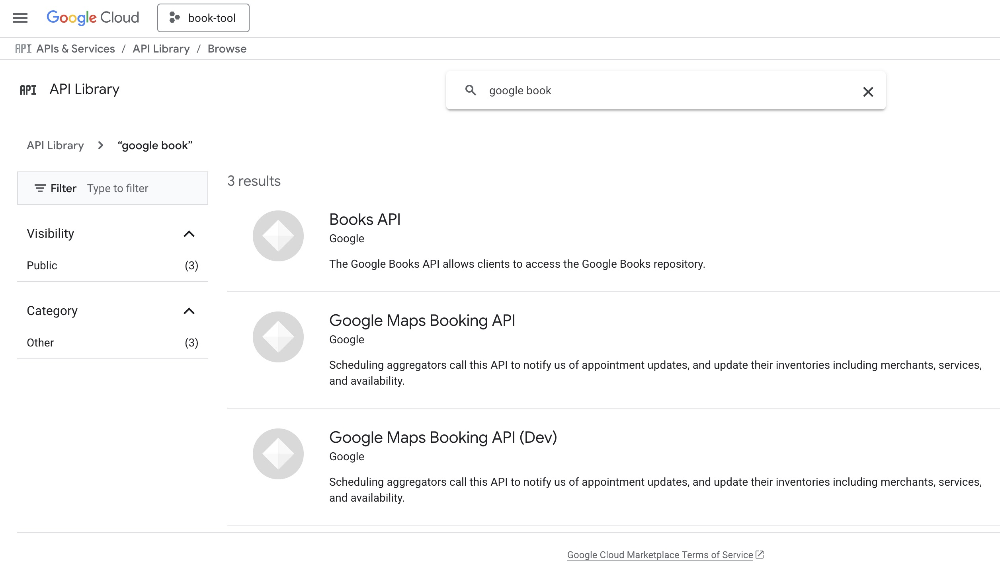
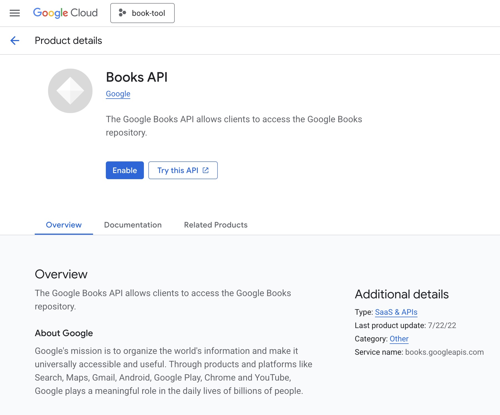
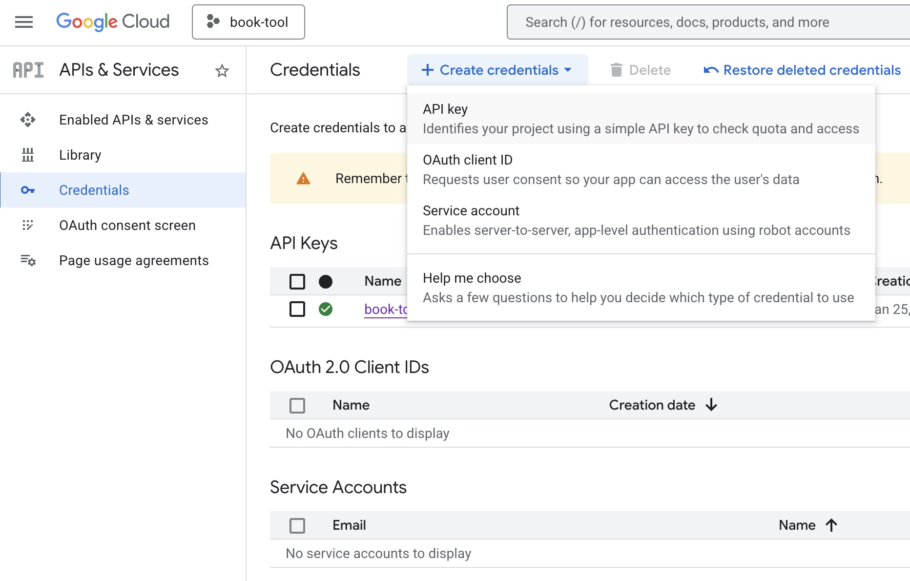

# Book Tool

[![python][python-src]][python-href]

Python CLI to handle books.

> [!IMPORTANT]
> Not ready for production.

## Using as CLI

```sh
pip install -e .
```

```sh
book-tool build ./path/to/epub
```

## Metadata

### APIs

- [Google Books API](https://developers.google.com/books)
- [Open Library API](https://openlibrary.org/developers/api)
- [The StoryGraph API](https://github.com/ym496/storygraph-api)

### GUI

- [Booknode](https://booknode.com/) FR
- [Goodreads](https://www.goodreads.com/) EN
- [The StoryGraph](https://app.thestorygraph.com/browse?sort_order=Last+updated)

## Get Google Books API key

- Go to <https://console.cloud.google.com/welcome>
- Create new project
- Go to <https://console.cloud.google.com/apis/dashboard>, choose **Library** on left side panel


- Search **Books** into search bar


- Choose **Books API**



- Enable Books API



- Go to <https://console.cloud.google.com/apis/dashboard> again and choose **Credentials** on left side panel
- Select **Create credentials** button, choose _API key_



- You can now restrict API with _Books API_


[python-src]: https://img.shields.io/static/v1?style=flat&label=Python&message=v3.12&color=3776AB&logo=python&logoColor=ffffff&labelColor=18181b
[python-href]: https://www.python.org/
