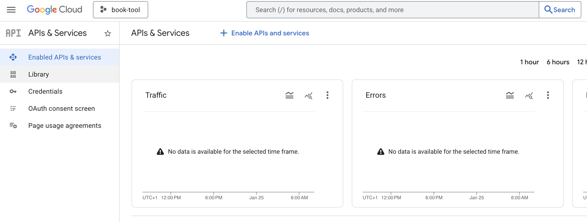
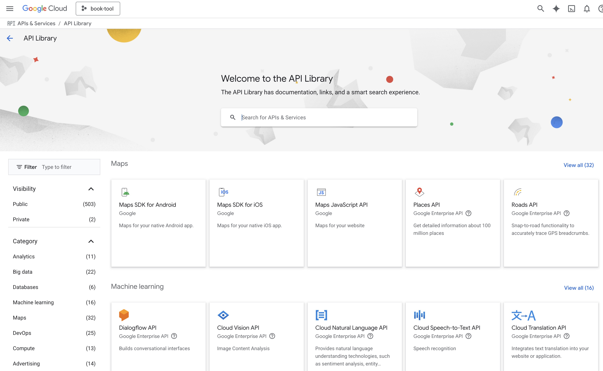
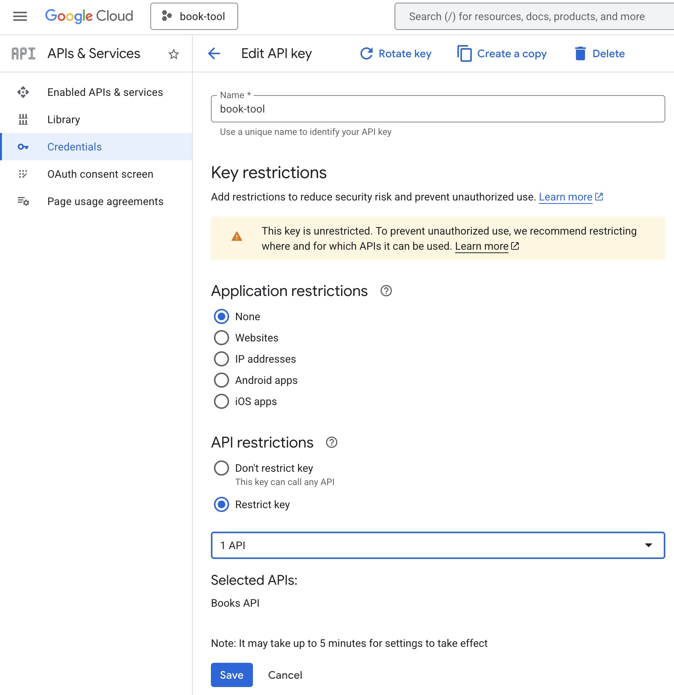

# Google Books API

[Google Books](https://books.google.com/) is a powerful service hosted by Google to search about books. This service offer an API, so this project uses [Google Books API](https://developers.google.com/books) to find books metadata.

## Get Google Books API key

Set up Google Books API key can be very complicated, here is a guide to obtain it.

- Go to <https://console.cloud.google.com/welcome>
- Create new project
- Go to <https://console.cloud.google.com/apis/dashboard>, choose **Library** on left side panel

- Search **Books** into search bar

- Choose **Books API**

- Enable Books API

- Go to <https://console.cloud.google.com/apis/dashboard> again and choose **Credentials** on left side panel
- Select **Create credentials** button, choose _API key_

- You can now restrict API with _Books API_
- Display your API key

[python-src]: https://img.shields.io/static/v1?style=flat&label=Python&message=v3.12&color=3776AB&logo=python&logoColor=ffffff&labelColor=18181b
[python-href]: https://www.python.org/
